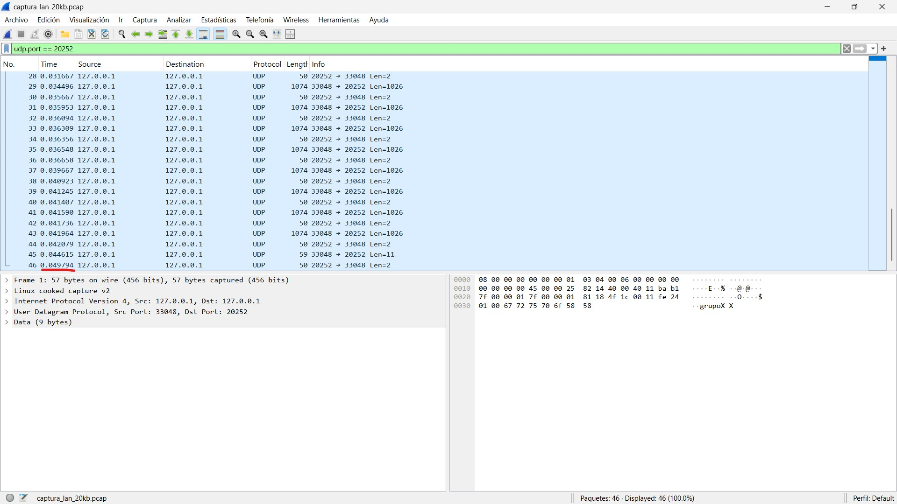
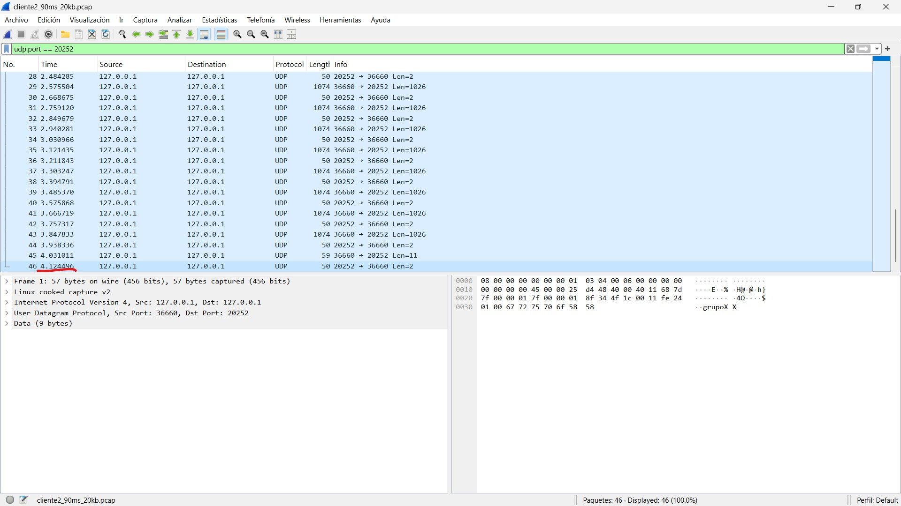
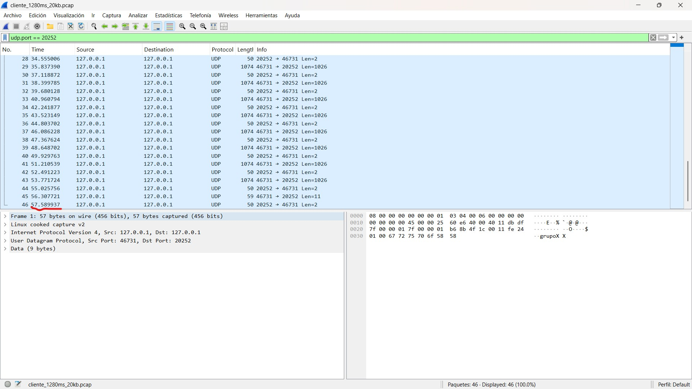

# Transferencia de archivos sobre UDP + análisis de delays · Redes de Computadoras

Implementación en C de un protocolo de transferencia de archivos sobre **UDP** (cliente/servidor con PDUs `HELLO`/`WRQ`/`DATA`/`FIN`), más un análisis experimental del impacto de la latencia sobre el tiempo de transferencia.

> Trabajo práctico de **Redes de Computadoras** (Universidad de San Andrés).

## Contenido

- **Parte 1 (`tests_p1/`)** — Protocolo propio sobre UDP: cliente y servidor en C, con handshake, envío de datos por bloques y cierre. Incluye suite de tests y validación por checksum (MD5).
- **Parte 2 (`tests_p2/`)** — Medición y graficado de **delays** de transferencia bajo distintas condiciones de red, con capturas de tráfico en Wireshark.

## Evidencia y resultados

**Captura en Wireshark (caso 1):**



**Caso 2:**



**Caso 3:**



## Compilación (Parte 1)

```bash
cd tests_p1
gcc -Wall -Wextra -std=c11 -Isrc src/server.c -o server_udp
gcc -Wall -Wextra -std=c11 -Isrc src/client.c -o client_udp
```

Genera `server_udp` y `client_udp`.

## Uso

**Servidor** (no recibe parámetros; escucha en el puerto de `protocol.h`, por defecto `20252`):

```bash
./server_udp
# Servidor UDP escuchando en puerto 20252...
```

**Cliente:**

```bash
./client_udp <server_ip> <credencial> <archivo_local> <nombre_remoto>
```

- `<server_ip>`: IP del servidor (`127.0.0.1` para pruebas locales).
- `<credencial>`: cadena enviada en la PDU `HELLO` (en los tests se usó `TEST`).
- `<archivo_local>`: ruta del archivo a enviar (se abre en binario).
- `<nombre_remoto>`: nombre con el que el servidor lo guarda. Debe ser ASCII, mínimo 4 caracteres; si no tiene extensión, máximo 10.

Ejemplo local:

```bash
# terminal 1
./server_udp
# terminal 2
./client_udp 127.0.0.1 TEST prueba1 prueba1
```

## Análisis de delays (Parte 2)

```bash
python graficar_delays.py
```

Toma los `.csv` de `tests_p2/delays/` (medidos bajo distinta pérdida/latencia) y grafica el tiempo de transferencia en función del delay.
